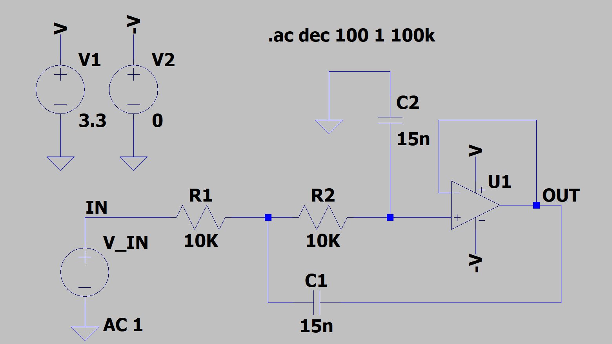
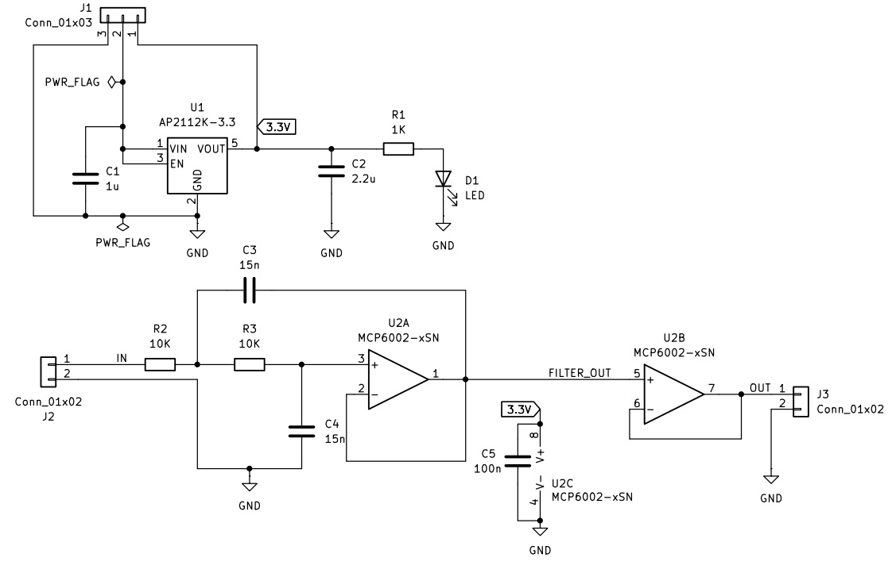

# Analog Front-End (AFE) Active Low-Pass Filter Module

A custom 2-layer printed circuit board (PCB) designed in KiCad for sensor signal conditioning in embedded hardware systems. This module combines a low-noise $3.3\text{V}$ Low-Dropout (LDO) power regulator with a 2nd-order active Sallen-Key low-pass filter ($f_c \approx 1.06\text{ kHz}$) and a unity-gain buffer stage to attenuate high-frequency noise prior to Analog-to-Digital Converter (ADC) sampling.

---

## Technical Specifications

* **Input Voltage ($V_{CC}$):** $5.0\text{V DC}$ nominal
* **Regulated Rail ($V_{DD}$):** $3.3\text{V DC}$ (AP2112K-3.3 LDO, up to $600\text{mA}$)
* **Filter Topology:** 2nd-Order Sallen-Key Low-Pass Filter + Output Voltage Follower Buffer
* **Characteristic Frequency ($f_c$):** $1.061\text{ kHz}$ ($-6\text{ dB}$)
* **Roll-off Rate:** $-40\text{ dB/decade}$
* **Active Components:** 
[MCP6002 Dual Rail-to-Rail CMOS Operational Amplifier (SOIC-8)](https://ww1.microchip.com/downloads/aemDocuments/documents/MSLD/ProductDocuments/DataSheets/MCP6001-1R-1U-2-4-1-MHz-Low-Power-Op-Amp-DS20001733L.pdf) , 
[AP2112K-3.3 LDO (SOT-23-5/SOT-25)](https://gr.mouser.com/datasheet/3/175/1/AP2112.pdf)
* **PCB Form Factor:** 2-Layer, $30\text{ mm} \times 40\text{ mm}$, hybrid SMT ICs with through-hole passives for rapid benchtop prototype assembly.

---

## Circuit Architecture & Calculations

### 1. Power Management & Decoupling
* **LDO Regulator:** AP2112K-3.3 steps down $5\text{V}$ $V_{CC}$ to a quiet $3.3\text{V}$ analog power rail.
* **Input/Output Capacitors:** $1\ \mu\text{F}$ MLCC on $V_{IN}$ and a $2.2\ \mu\text{F}$ MLCC on $V_{OUT}$. The $2.2\ \mu\text{F}$ value was selected over the $1\ \mu\text{F}$ minimum datasheet rating to account for ceramic DC-bias capacitance derating at $3.3\text{V}$ operating potential.
* **Local Decoupling:** A $100\text{ nF}$ ceramic capacitor is placed directly adjacent to the MCP6002 op-amp $V_{DD}$ pin (Pin 8) to mitigate high-frequency supply ripple.

### Sallen-Key Low-Pass Filter

The characteristic frequency ($f_0$) for the selected equal-component configuration ($R_1 = R_2 = 10\text{ k}\Omega$, $C_1 = C_2 = 15\text{ nF}$) is:

$$f_0 = \frac{1}{2\pi \sqrt{R_1 R_2 C_1 C_2}} \approx 1,061\text{ Hz}$$

Because $C_1 = C_2$, $R1 = R2$ and because tha operational amplifier is configured as a unity gain buffer (A = 1), the filter operates with $Q = 0.5$ (critically damped response):
* **Characteristic Frequency ($f_0$):** $1.061\text{ kHz}$ ($-6\text{ dB}$ attenuation)
* **Half-Power Cutoff Frequency ($f_{-3\text{dB}}$):** $\approx 683\text{ Hz}$ ($-3\text{ dB}$ attenuation)


### 3. Output Buffer
Op-Amp Channel B of MCP6002 is configured as a unity-gain voltage follower (connecting `OUTB` Pin 7 to `INB-` Pin 6). This presents a high input impedance to the filter stage and a low output drive impedance to downstream microcontrollers, eliminating loading effects on the filter's frequency response.

---

## LTspice Simulation

Prior to layout, the Sallen-Key low-pass filter was validated in LTspice using small-signal AC frequency analysis.



<br />

* **Simulation Directive:** `.ac dec 100 1 100k`
* **Passband Gain:** $0\text{ dB}$ up to $100\text{ Hz}$
* **$-6\text{ dB}$ frequency:** Verified at $\approx 1.06\text{ kHz}$
* **$-3\text{ dB}$ frequency:** Verified at $\approx 683\text{ Hz}$
* **Stopband Attenuation:** Confirmed $-40\text{ dB/decade}$ attenuation slope above cutoff frequency.

<table align="center">
    <thead>
        <tr>
            <th scope="col">Frequency at -3 dB</th>
            <th scope="col">Frequency at -6 dB</th>
            <th scope="col">Attenuation slope above cutoff frequency</th>
        </tr>
    </thead>
    <tbody> 
        <tr>
            <td>
                <a href="docs\minus3dB.jpg">  </a> 
            </td>
            <td>
                <a href="docs\minus6dB.png">  </a>
            </td>
            <td>
                <a href="docs\roll_off.png">  </a>
            </td>
        </tr> 
    </tbody> 
</table>
<p align="center">
  <em>Measurings on the Bode plot output for the V(out) trace (Gain = 1).</em>
</p>

<br />

---

## Board Pinout & Interface



| Header | Pin | Name | Type | Description |
| :--- | :--- | :--- | :--- | :--- |
| **Power (J1)** | 1 | `3.3V` | Power | $+3.3\text{V}$ Regulated Output Rail |
| | 2 | `VCC` | Power | $+5.0\text{V}$ Unregulated Power Input |
| | 3 | `GND` | Power | Common System Ground Plane |
| **Input (J2)** | 1 | `IN` | Analog Input | Raw Signal Input from Sensor |
| | 2 | `GND` | Power | Signal Ground |
| **Output (J3)**| 1 | `OUT` | Analog Output| Conditioned & Buffered Signal to ADC |
| | 2 | `GND` | Power | Signal Ground |

---

## PCB Layout Considerations

<table align="center">
    <thead>
        <tr>
            <th scope="col">PCB Front 3D View with Visible Components</th>
            <th scope="col">PCB Back 3D View with Visible Components</th>
        </tr>
    </thead>
    <tbody> 
        <tr>
            <!-- <th scope="row"></th> -->
            <td>
                <a href="docs\analog_filter_modules_front_models.png"> 
                     
                </a> 
            </td>
            <td>
                <a href="docs\analog_filter_modules_back_models.png"> 
                      
                </a> 
            </td>
        </tr> 
        <tr>
            <th scope="col">PCB Front 3D View</th>
            <th scope="col">PCB Back 3D View</th>
        </tr>
        <tr>
            <td>
                <a href="docs\analog_filter_modules_front.png"> 
                     
                </a> 
            </td>
            <td>
                <a href="docs\analog_filter_modules_back.png"> 
                      
                </a> 
            </td>
        </tr> 
    </tbody> 
</table>
<p align="center">
  <em>3D Views of the PCB design.</em>
</p>

<br />

* **Ground Pour Strategy:** Top (`F.Cu`) and Bottom (`B.Cu`) layers are poured with continuous `GND` copper fills to provide a low-impedance ground return path and improve thermal dissipation.
* **Component Placement:** Power routing and decoupling components are placed close to the board headers and active supply pins to minimize current loop inductance.
* **Signal Isolation:** Analog input and output traces are routed with high clearance from power lines to reduce crosstalk and noise coupling.

---

## Repository Structure

```text
.
├── docs/                 # LTspice schematics, Bode plot outputs, PCB Views, BOM
├── gbr/                  # Production Gerber and Excellon drill files for PCB manufacturing
├── kicad/
│   ├── Analog_Filter.kicad_sch  # KiCad schematic design
│   ├── Analog_Filter.kicad_pcb  # PCB layout & routing
│   └── Analog_Filter.pro        # KiCad project file
└── README.md             # Project overview
